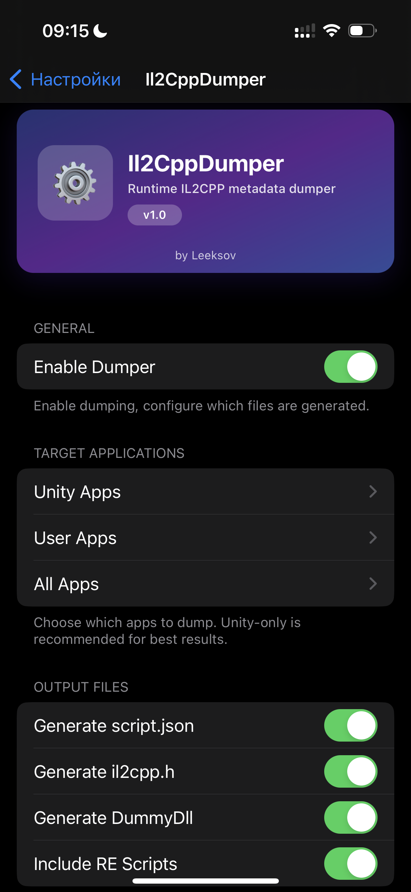
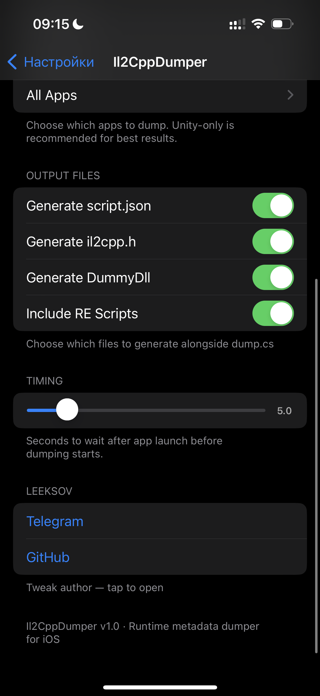
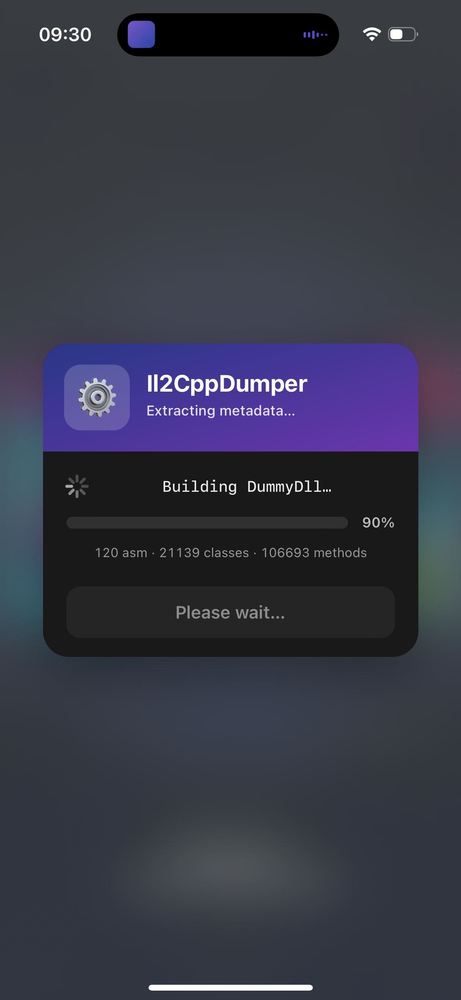
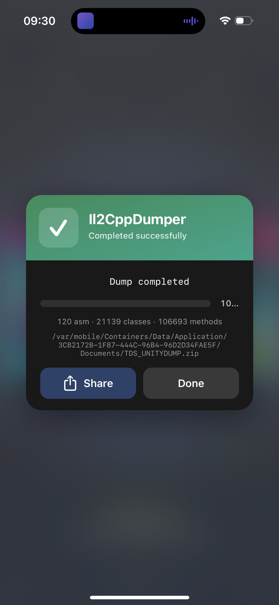

# Il2CppDumper — iOS Tweak

A runtime IL2CPP metadata dumper for jailbroken iOS.
Extracts full C# metadata (`dump.cs`, per-assembly headers, `il2cpp.h`, `script.json`, `DummyDll/`) from any Unity game at runtime — no offsets needed, no version lock-in.

Works on **all IL2CPP versions** (Unity 2018.3 → Unity 6).

---

## Features

- **Dump.cs** — full C# pseudocode of every class, field, property, method
- **Per-assembly `.cs` files** — split output for each managed DLL
- **`il2cpp.h`** — C struct definitions for IDA/Ghidra import
- **`script.json`** — method RVAs with full namespace.Class$$method names
- **`DummyDll/`** — real .NET PE assemblies with `[Address(RVA="…")]` and `[FieldOffset(Offset="…")]` custom attributes, ready to open in dnSpy/ILSpy
- **RE scripts bundled** — `ida.py`, `ida_py3.py`, `ghidra.py`, `hopper-py3.py`, binja/ghidra header converters
- **Preferences UI in Settings.app** — per-app toggles, metadata detection, live search
- **In-app HUD overlay** — blur backdrop, gradient card, live progress bar, status text, stats, Share & Done buttons
- **Crash-safe** — every class / field / method is wrapped in `@try/@catch`; a single broken class doesn't abort the dump

---

## Installation

1. Build the `.deb` with `make package` (Theos + rootless scheme required)
2. Install on jailbroken device (Dopamine / palera1n)
3. Open **Settings → Il2CppDumper**:
   - Enable the master switch
   - Select target apps (the **Unity Apps** category auto-detects IL2CPP metadata)
   - Configure output files and wait time
4. Launch the game — the HUD will appear and show live dump progress
5. Tap **Share** on success to send the `.zip` via AirDrop / Files / Messages

---

## Output Structure

```
AppName_UNITYDUMP.zip
├── dump.cs                 # full combined C# dump
├── script.json             # method RVAs for IDA/Ghidra
├── il2cpp.h                # C struct definitions
├── logs.txt                # dump statistics
├── Assembly/
│   ├── Assembly-CSharp.cs
│   ├── mscorlib.cs
│   └── ...                 # per-assembly splits
├── DummyDll/
│   ├── Assembly-CSharp.dll # .NET DLLs with RVA attributes
│   └── ...                 # open in dnSpy
└── scripts/
    ├── ida.py
    ├── ida_py3.py
    ├── ghidra.py
    └── ...                 # bundled RE helper scripts
```

---

## Screenshots

### Settings

<p align="center">
  
  
</p>

### In-game HUD

<p align="center">
  
  
  
</p>

---

## Build

```bash
cd Il2CppDumper

# Rootless (Dopamine, palera1n rootless)
THEOS_PACKAGE_SCHEME=rootless make clean package FINALPACKAGE=1

# Rootful (unc0ver, Taurine)
THEOS_PACKAGE_SCHEME= make clean package FINALPACKAGE=1
```

The resulting `.deb` appears in `Il2CppDumper/packages/`.

---

## Credits & Thanks

- [Tien0246](https://github.com/tien0246) — original [IOS-Il2CppDumper](https://github.com/tien0246/IOS-Il2CppDumper)
- [Batchhh](https://github.com/Batchhh)
- [Perfare / Il2CppDumper](https://github.com/Perfare/Il2CppDumper) — reference implementation
- [UE4Dumper-4.25](https://github.com/guttir14/UnrealDumper-4.25)
- [Zygisk-Il2CppDumper](https://github.com/Perfare/Zygisk-Il2CppDumper)
- [zxsrxt-kebab-case](https://github.com/zxsrxt-kebab-case) — runtime dumper improvements

Tweak & UI by [**Leeksov**](https://github.com/Leeksov) · [Telegram](https://t.me/leeksov_coding)
